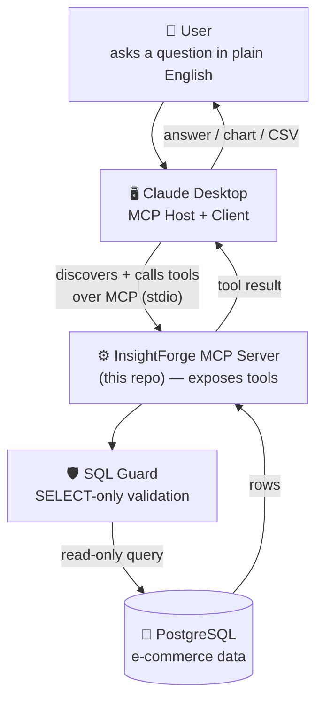
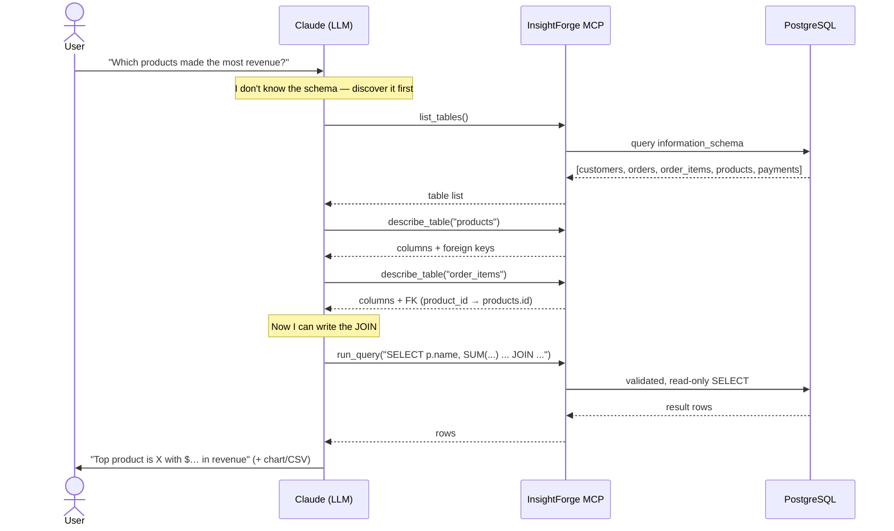
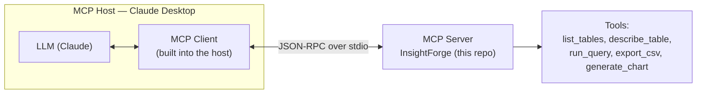
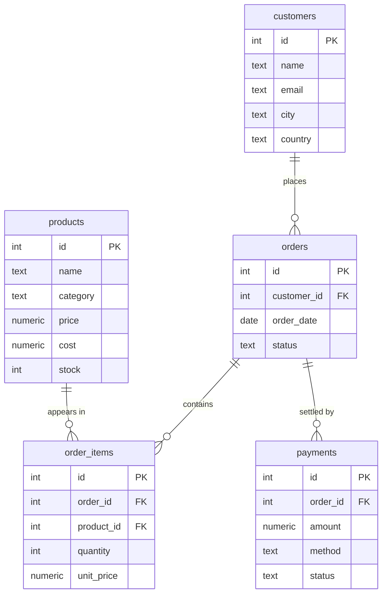

# InsightForge MCP

> An **MCP (Model Context Protocol)** server that turns a PostgreSQL database into an
> **AI Business Analyst**. The LLM never sees the schema up front — it *discovers*
> your tables at runtime, writes its own SQL, and answers questions like
> *"Which products generated the highest revenue in the last 3 months?"*

This is a learning project for understanding how MCP lets an LLM dynamically
discover and orchestrate tools.



The model acts like a junior data analyst — it doesn't know the schema, so it
**discovers** it, then writes its own SQL:



---

## The tools the LLM discovers

| Tool | What it does |
|------|--------------|
| `list_tables()` | List public tables + approximate row counts. |
| `describe_table(table_name)` | Columns, types, and **foreign keys** (so the model can JOIN correctly). |
| `run_query(sql)` | Execute a **read-only** `SELECT`. Writes are rejected; a row limit is enforced. |
| `export_csv(sql, filename)` | Run a query and write the rows to a CSV in `backend/exports/`. |
| `generate_chart(sql, x, y, kind, title, filename)` | Run a query and render a `bar`/`line`/`pie` PNG chart. |

---

## How it works

MCP standardises *how an LLM talks to external tools*. Three roles are involved:



1. **Handshake.** When Claude Desktop launches the server, the client asks
   *"what tools do you have?"*. The server replies with each tool's **name,
   description, and JSON input schema** — generated automatically from the
   Python type hints + docstrings in [`server.py`](backend/src/insightforge_mcp/server.py).
2. **Discovery, not hard-coding.** The LLM now *knows the tools exist* purely
   from those descriptions. Nothing about the database schema is baked in.
3. **Tool calling.** Given a question, the LLM decides which tool to call and
   with what arguments. The client invokes it, the server runs the Python
   function, and the return value (a JSON dict) goes back to the model.
4. **Orchestration loop.** The model chains calls — `list_tables` →
   `describe_table` → `run_query` → `generate_chart` — reasoning about each
   result before the next call, until it can answer the user.

The key idea: **the server provides capabilities; the LLM provides the
reasoning about when and how to use them.**

---

## What you need to know

A quick map of the four concepts this project teaches — and the questions an
interviewer tends to ask about each.

### 1. MCP (Model Context Protocol)
- **Server** — exposes tools (what this repo is).
- **Client** — speaks the protocol; lives *inside* the host. You don't build it.
- **Host** — the app the user talks to (Claude Desktop). It owns the LLM.
- **Transport** — here it's **stdio** (the host launches the server as a
  subprocess and exchanges JSON-RPC over stdin/stdout).

> **Q: Why MCP instead of a REST API?**
> A REST client must know every endpoint in advance. With MCP the server
> *advertises* its tools at connect time, so the LLM discovers and uses them
> dynamically — no client code changes when you add a tool.

> **Q: How does the LLM know what tools exist?**
> During the MCP handshake the server returns each tool's name, description,
> and input schema. The model reads those and decides when to call them.

### 2. PostgreSQL
You only need basic SQL. The sample DB models a small e-commerce business
(see the ER diagram below). The interesting analytical fact: **revenue lives
in `order_items`** as `quantity * unit_price`.

### 3. The tools (the heart of the project)
Each `@mcp.tool()` function in [`server.py`](backend/src/insightforge_mcp/server.py)
is a capability. The **docstring matters** — it's what the model reads to pick
the right tool, so keep it clear and action-oriented.

### 4. The LLM orchestration
The model is a planner: discover schema → generate SQL → execute → analyse →
answer. It self-corrects from error messages (that's why tools return
`{"error": "..."}` instead of crashing).

> **Q: How does the LLM generate correct SQL without knowing the schema?**
> It calls `describe_table` first, learns the columns and **foreign keys**,
> and builds the JOINs from those relationships.

> **Q: What are the security concerns?**
> Never let the model run writes. Allow only `SELECT`. This project enforces
> that in three layers — see [Security model](#security-model-defence-in-depth).
> The strongest production answer: connect with a `SELECT`-only DB role.

---

## Project layout

```
InsightForge-MCP/
├─ .env                  # local secrets (git-ignored)
├─ .env.example          # template — copy to .env
├─ .gitignore
├─ CLAUDE.md             # guidance for Claude Code working in this repo
├─ README.md
└─ backend/
   ├─ pyproject.toml
   ├─ requirements.txt
   ├─ exports/           # generated CSVs + charts
   ├─ scripts/
   │  ├─ schema.sql      # the sample e-commerce schema
   │  ├─ init_db.py      # create the tables
   │  └─ seed_data.py    # load ~500 customers / 1000 products / 10k orders
   ├─ src/insightforge_mcp/
   │  ├─ config.py       # typed settings from .env
   │  ├─ database.py     # psycopg3 pool + read-only transactions
   │  ├─ sql_guard.py    # SELECT-only validation  ← security layer
   │  ├─ reporting.py    # CSV + chart rendering
   │  └─ server.py       # FastMCP server + tool definitions
   └─ tests/
      └─ test_sql_guard.py
```

---

## Setup

### 1. Prerequisites
- Python 3.11+
- A running PostgreSQL instance (local install or Docker)

```bash
# Quick Postgres via Docker (optional):
docker run --name insightforge-pg -e POSTGRES_PASSWORD=postgres \
  -p 5432:5432 -d postgres:16
```

### 2. Configure environment
```bash
cp .env.example .env
# Edit DATABASE_URL in .env if your Postgres differs.
# Make sure the target database exists, e.g.:
#   createdb insightforge      (or: CREATE DATABASE insightforge;)
```

### 3. Install dependencies (conda)
This project uses a **conda environment named `mcp`** on Python 3.11.9.
```bash
cd backend
conda create -y -n mcp python=3.11.9
conda activate mcp
pip install -r requirements.txt
```
> Prefer a plain virtualenv instead? `python -m venv .venv && .venv\Scripts\Activate.ps1 && pip install -r requirements.txt` works too — just point Claude Desktop at that interpreter.

### 4. Create the schema and load sample data
```bash
python scripts/init_db.py
python scripts/seed_data.py
```

### 5. Run the tests (optional)
```bash
pytest
```

### 6. Run the MCP server
```bash
python -m insightforge_mcp.server
```
The server speaks the MCP **stdio** transport — it's meant to be launched *by*
a host (Claude Desktop), not used standalone.

---

## Connecting to Claude Desktop

Add this to your Claude Desktop config
(`%APPDATA%\Claude\claude_desktop_config.json` on Windows,
`~/Library/Application Support/Claude/claude_desktop_config.json` on macOS).
Use **absolute paths**:

```jsonc
{
  "mcpServers": {
    "insightforge": {
      // Python interpreter inside the conda env "mcp"
      "command": "C:\\Users\\Shamlatech\\miniconda3\\envs\\mcp\\python.exe",
      "args": ["-m", "insightforge_mcp.server"],
      "cwd": "E:\\MCP\\InsightForge-MCP\\backend",
      "env": {
        "PYTHONPATH": "E:\\MCP\\InsightForge-MCP\\backend\\src"
      }
    }
  }
}
```

> Find your env's interpreter path with `conda run -n mcp python -c "import sys; print(sys.executable)"`.
> If you used a virtualenv instead, point `command` at `backend\.venv\Scripts\python.exe`.

Restart Claude Desktop, then ask:

> *What tables exist in the database?*
> *Which products generated the highest revenue in the last 3 months? Show a bar chart.*
> *Which customers generate the most profit? Export the result as CSV.*

Claude will call `list_tables` → `describe_table` → `run_query` on its own.

---

## Security model (defence in depth)

1. **`sql_guard.validate_select`** — rejects anything that isn't a single
   `SELECT`/`WITH` statement, strips comments to block keyword smuggling, and
   blocks stacked statements.
2. **Read-only transaction** — every query runs under
   `SET TRANSACTION READ ONLY` with a `statement_timeout`, so even a bypass of
   layer 1 cannot mutate data or hang the server.
3. **Row cap** — `MAX_QUERY_ROWS` limits how much data ever reaches the LLM.

> For production you'd also connect with a dedicated, `SELECT`-only database
> role — the cheapest and strongest guarantee of all.

---

## Sample schema

`customers` → `orders` → `order_items` → `products`, with `payments` settling
each order. See [`backend/scripts/schema.sql`](backend/scripts/schema.sql).



> Revenue lives in `order_items` (`quantity * unit_price`). The LLM discovers
> the `order_items.product_id → products.id` foreign key via `describe_table`
> and uses it to JOIN — which is exactly why `describe_table` returns FKs.
